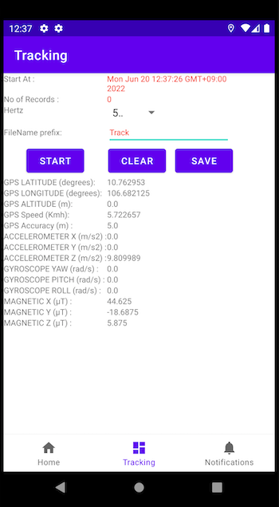
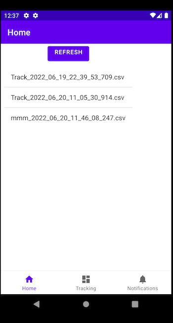

# IMU GPS Sensor Collector

## 1. Overview 

It's a part of master class school subject of HCM-US (K30).

This Android application collect data for learning / research purpose of 
- IMU sensor (ACCELEROMETER| GYROSCOPE| MAGNETIC)  
- GPS data 
- Custom rate (5Hz, 10Hz, 20Hz, 50Hz)

And save them to internal storage at DCIM/IMU_GPS_Collector with 
 - name : prefix_{yyyy_MM_dd_HH_mm_ss_sss.csv}.csv
 - csv file type with columns

| DATE (YYYY-MO-DD HH-MI-SS_SSS)| GPS LATITUDE (degrees)| GPS LONGITUDE (degrees)| GPS ALTITUDE (m)| GPS SPEED (Kmh)| GPS ACCURACY (m)| ACCELEROMETER X (m/s�) | ACCELEROMETER Y (m/s�)| ACCELEROMETER Z (m/s�)| GYROSCOPE Yaw (rad/s)| GYROSCOPE Pitch (rad/s)| GYROSCOPE Roll (rad/s)| MAGNETIC FIELD X (μT)| MAGNETIC FIELD Y (μT)| MAGNETIC FIELD Z (μT)

Application require permissions

  - ACCESS_COARSE_LOCATION

  - ACCESS_FINE_LOCATION

  - WRITE_EXTERNAL_STORAGE

  - READ_EXTERNAL_STORAGE

  - MANAGE_EXTERNAL_STORAGE

## 2.Feature

1. Tracking

2. Home (Files list)

## 3.Donate and data sharing

- Bug fixing + Feature is Welcome
- Contribute your collect data 
- We are sharing our collect data for learning / research purpose.

Let contact us via email: 20C11030@student.hcmus.edu.vn